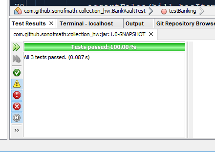
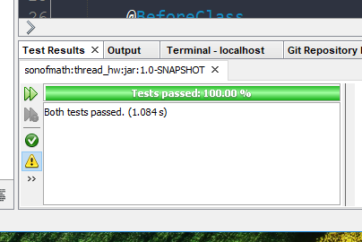

# java2018

## Kattis Problem - Soylent
Solution - https://github.com/sonofmath/java2018/tree/master/Kattis1
  -- nice work!
  
## Collections HW - Bank Vault
https://github.com/sonofmath/java2018/tree/master/collection_hw
```
Created a Bank Vault with Customers and Safe Deposit Boxes that they can add items to.  
```



## Threads HW - Our Classroom
https://github.com/sonofmath/java2018/tree/master/thread_hw
```
Created our class where speaking is the shared resource:
- Synchronization not working as I had planned
- Could not think of many good ways to test it so I only had a couple
- Would like to spend more time with threading
```

